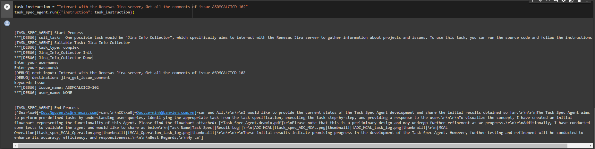
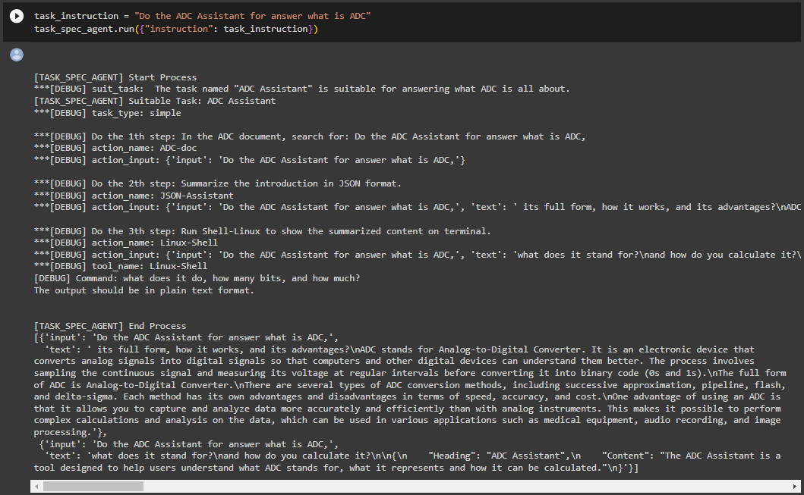
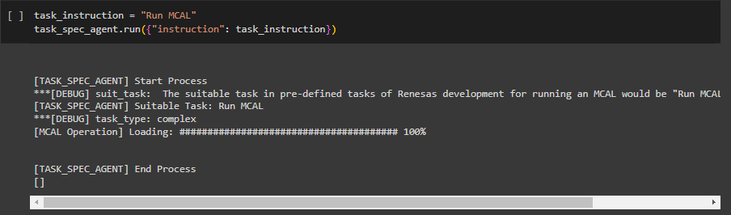

# General
This notebook has code blocks for:
```
Loading an LLM model
Indexing data from the given document.
Creating tool: Indexed QA chains, Jira tool, Confluence tool,..
Creating Instructor Agent and Task Spec Agent.
Running Agent to do task request from user.

```

# Getting started
To have the Agent running, you need to run code blocks from the top down.
Each code block has its title, you also could modify you running. Just make sure its logical running flow.

# Detail investigation
## Instructor Agent
- [] [Jira Links](https://jira.renesas.eu/browse/ASDMCALCICD-101)

## Task Spec Agent
- [] [Jira Links](https://jira.renesas.eu/browse/ASDMCALCICD-102)

## Concepts and Flowcharts
- [] [Confluence Link: Agents Implementation](https://jira.renesas.eu/confluence/display/ASDMCALCICD/%5BMCAL_AI%5D+Agents+Implementation)
- [] [Confluence Link:  Concepts and Flowcharts](https://jira.renesas.eu/confluence/display/ASDMCALCICD/%5BMCAL_AI%5D+LangChain+Concepts+Investigation)

# Examples
## Ex.01: User get comment from Issue with the given ID


## Ex.02: User request Agent to run MCAL sample process


## Ex.03: User ask for "what is ADC", Agent uses ADC QA Chain to answer, and run Shell comamnd to save.

