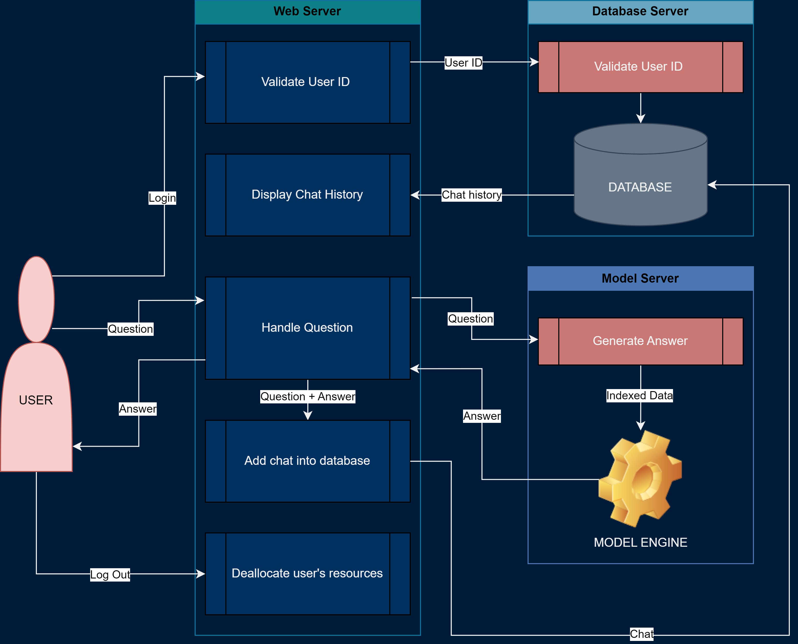
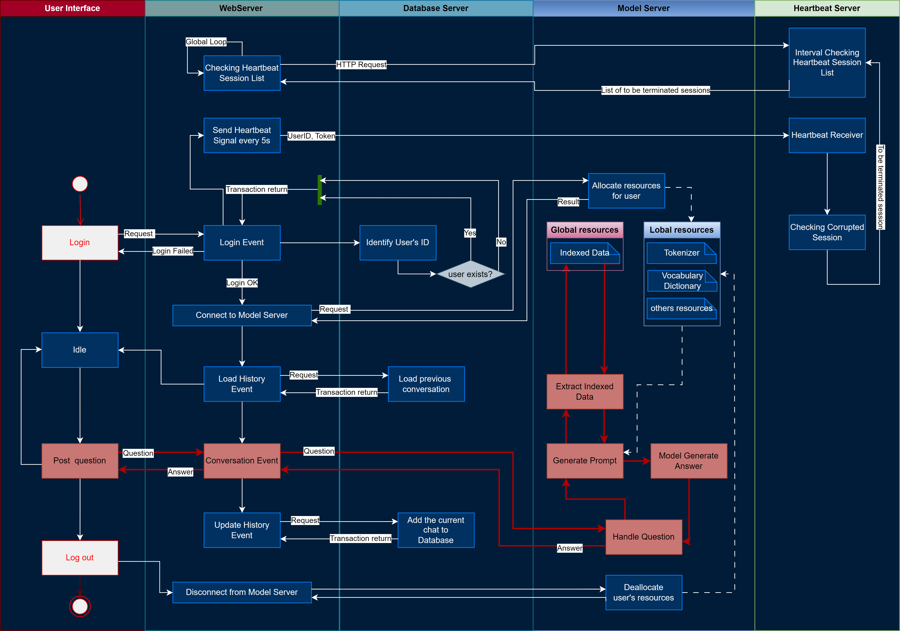
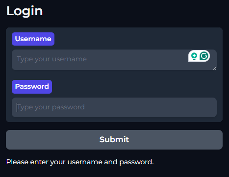
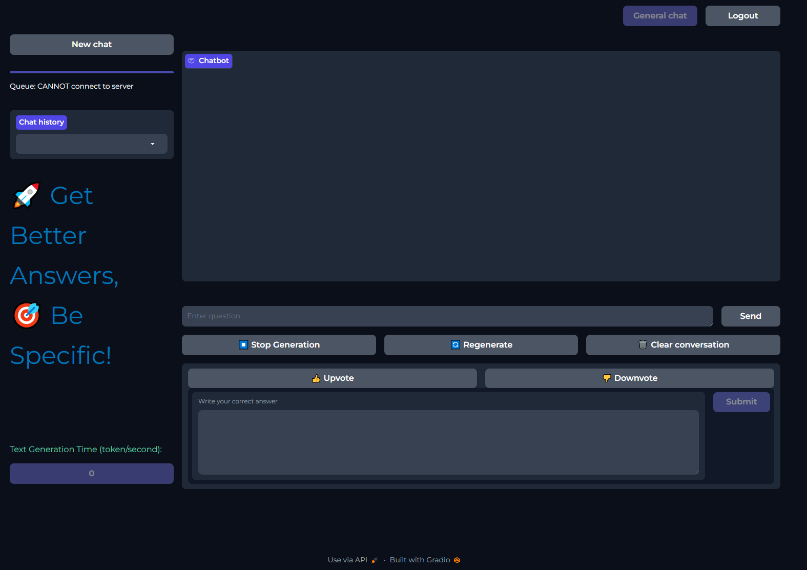

# Overview

MCAL Chatbot is an AI-powered assistant designed to assist MCAL (Microcontroller Abstraction Layer) developers in efficiently searching for relevant information from MCAL documents. The chatbot employs advanced techniques, including a Retrieval Augmented Generation component, a Language Model (LLM) core engine for answering user questions, and features a user-friendly web chat UI. Additionally, it utilizes a database to store and manage user conversations.

# System Design and Features
## System Design
### User Viewpoint

### Developer Viewpoint

## Features
### Login UI

### Main Chat UI

# Documentation
For comprehensive knowledge, please refer to [Documentation](./Documentation.pdf)

## Installation
For detailed instructions, please refer to [Install_Guideline](./Install_Guideline.md)

## Contributing
Contributions are welcome! If you have any ideas for improvements or new features, feel free to open an issue or submit a pull request.